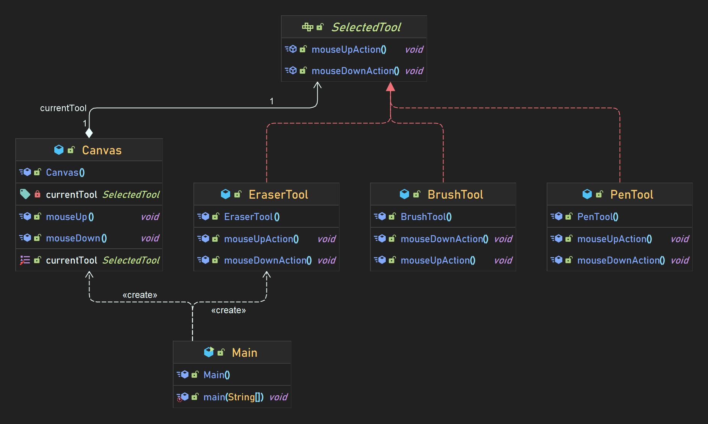
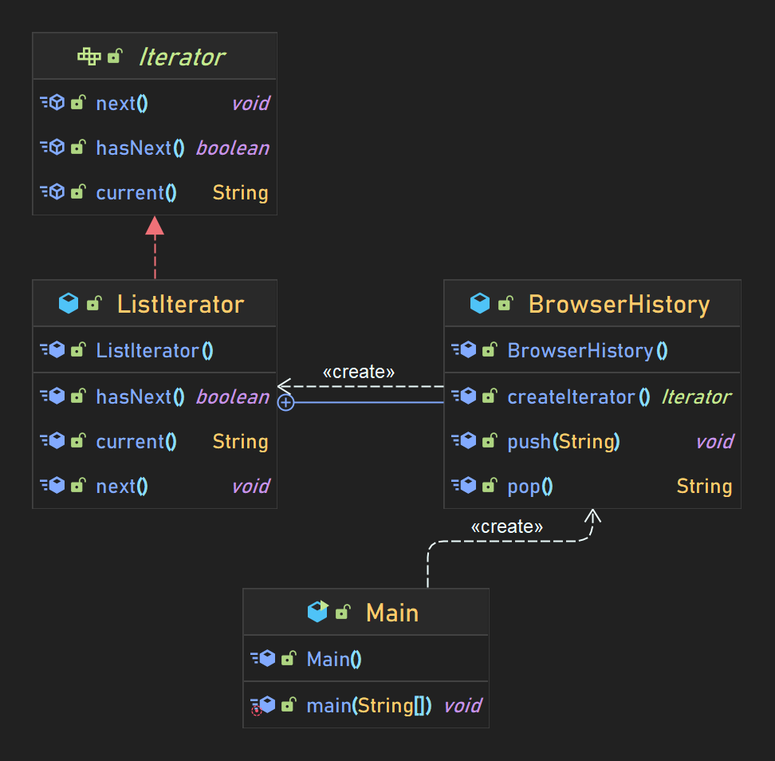
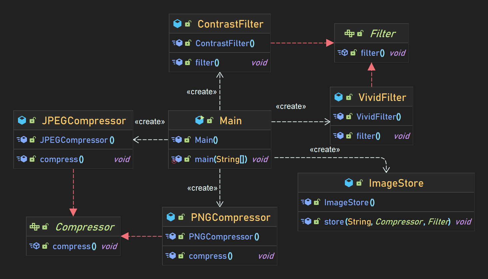
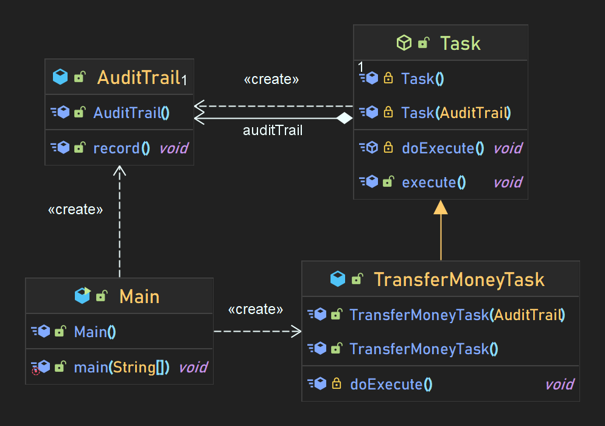
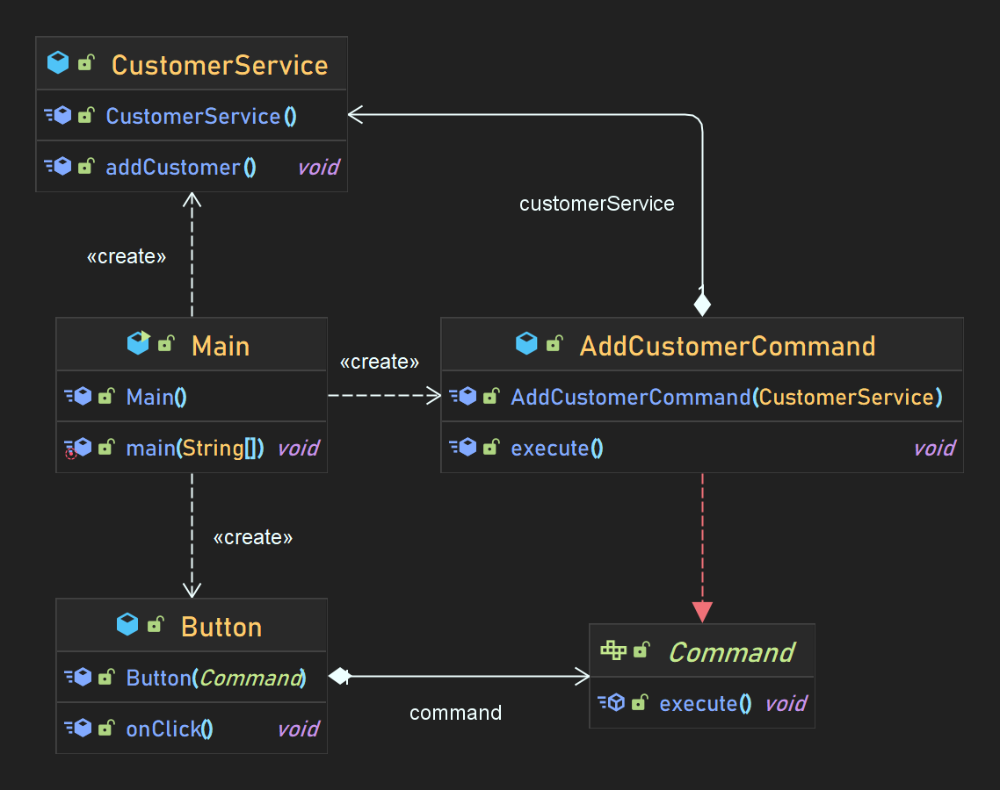
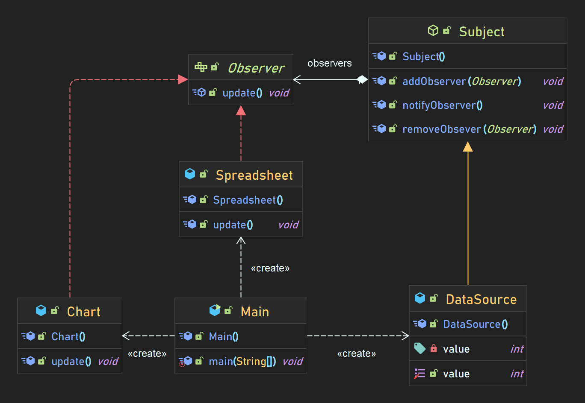

# Object Oriented Design Patterns
### by Gang of Four
## Creational Patterns
1. a
2. b
## Structural Patterns
1. a
2. b
## Behavioural Patterns
1. ### Memento Pattern
    
2. ### State Pattern
    
3. ### Iterator Pattern
    
4. ### Strategy Pattern
    
5. ### Template Method Pattern
    
6. ### Command Pattern
    
7. ### Observer Pattern
    
